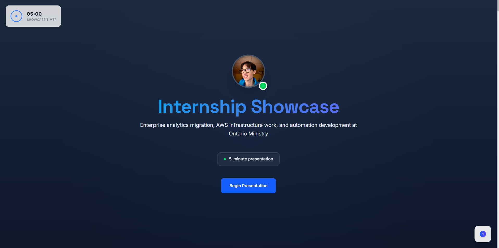
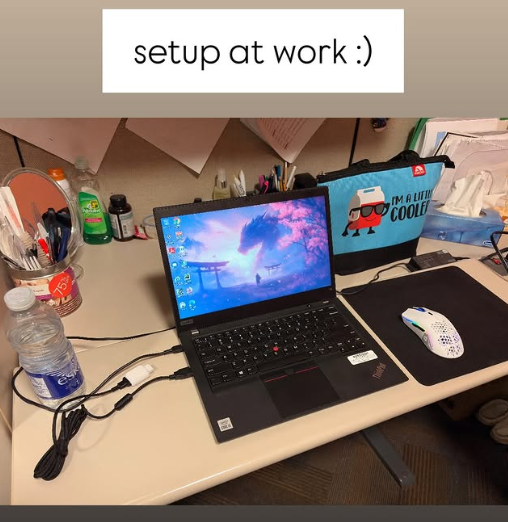
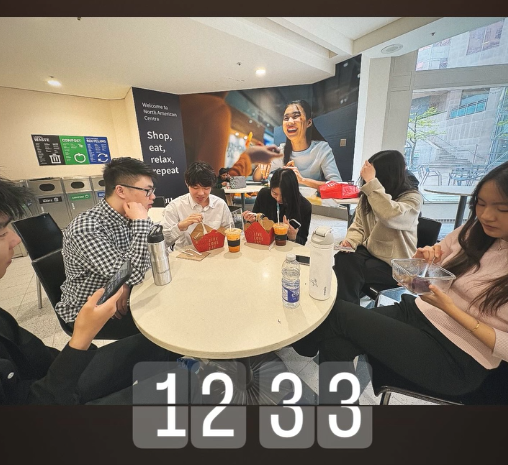

# MOH Summer 2025 Internship Showcase

> **Live Demo**: [https://alex-moh-summer-2025.netlify.app/](https://alex-moh-summer-2025.netlify.app/)

An interactive web showcase documenting my summer 2025 internship experience at the Ontario Ministry of Public & Business Service Delivery and Procurement. Built as a scroll-driven story with a 5-minute countdown timer to highlight key projects, achievements, and technical contributions.



## Overview

This project showcases real-world enterprise software development experience, including SAS Viya migration work, automation script development, and collaborative team projects. The site features smooth scroll animations, interactive timelines, and responsive design optimized for both desktop and mobile viewing.

## Key Features

- **Interactive Timeline**: Scroll-driven storytelling with pinned sections
- **5-Minute Experience**: Timed showcase designed for quick viewing
- **Technical Deep Dives**: Detailed project documentation with visual examples
- **Performance Metrics**: Quantified impact and achievements
- **Responsive Design**: Optimized for all screen sizes
- **Accessibility**: Full keyboard navigation and reduced motion support

## Technical Stack

- **Frontend**: React 18 + TypeScript
- **Build Tool**: Vite
- **Styling**: Tailwind CSS v4
- **Animations**: Framer Motion + GSAP ScrollTrigger
- **Smooth Scrolling**: Lenis
- **Deployment**: Netlify

## Project Highlights

### SAS Viya Migration Support
- Assisted with enterprise migration from SAS Enterprise Guide to SAS Viya
- Performance testing and optimization of SAS macro executions
- Documentation and troubleshooting of migration processes



### Automation Development
- Created Python automation scripts for data processing workflows
- Implemented testing frameworks for script validation
- Collaborated on remediation tools for data quality assurance

### Team Collaboration
- Worked alongside experienced developers and data analysts
- Participated in code reviews and technical discussions
- Contributed to team knowledge sharing and documentation



## Development Approach

### Code Quality
- TypeScript for type safety and better developer experience
- ESLint configuration for consistent code style
- Component-based architecture with reusable modules
- Performance optimization with lazy loading and memoization

### Accessibility
- Semantic HTML structure with proper ARIA labels
- Keyboard navigation support throughout the application
- Reduced motion preferences respected
- Focus management for screen readers

### Performance
- Optimized bundle size with code splitting
- Efficient animation rendering with RAF (RequestAnimationFrame)
- Image optimization and lazy loading
- Responsive design with mobile-first approach

## Getting Started

### Prerequisites
- Node.js 18+ 
- npm or yarn

### Installation
```bash
git clone https://github.com/Dawgsrlife/moh-showcase.git
cd moh-showcase
npm install
```

### Development
```bash
npm run dev
```

### Build
```bash
npm run build
```

### Lint
```bash
npm run lint
```

## Project Structure

The codebase follows a modular architecture with clear separation of concerns:

- **Components**: Reusable UI components with TypeScript interfaces
- **Sections**: Main content sections with scroll-driven animations
- **Hooks**: Custom React hooks for state management and effects
- **Data**: Structured content and configuration
- **Utilities**: Helper functions and animation libraries

## Deployment

The site is automatically deployed to Netlify on every push to the main branch. The deployment includes:

- Automatic builds using the Vite build system
- SPA routing configuration for client-side navigation
- Performance optimizations and asset compression

## Contact

**Alexander He Meng**  
Application Programmer (Co-op)  
Ontario Ministry of Public & Business Service Delivery & Procurement

---

*This showcase represents real work and achievements from a summer 2025 internship position. All content and code examples reflect actual projects and contributions made during the internship period.*
